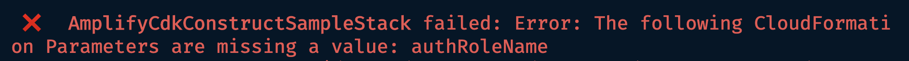

# Trip Logger L3

Rene went ahead and put this as a regular CDK project. I'm curious to see how this works. I'm not seeing the helper file in here anymore.

This is going to be a test of what this construct looks like in a real (yet simple) application.

## Architecture Overview

The architecture is as follows:


## Project Overview

The project is a trip logging app. Unauthenticated users can view trips. Signed in users can perform CRUD operations on their own trips but one else. Signed in users can batch upload trips. Lastly, user can ask chatGPT to write a description of a trip for them.

## Project Setup

I installed the packages and noticed that the resources are in a single stack contained in more or less one file. This makes sense since CDK projects tend to be opinionated in structure. My preference is to split out the various resources into their own directories, but still deploy a single stack.

My first task is to refactor the AppSync API to a `createAPI` function located in a `lib/api/appsync.ts` file.

I've done this a couple times before and settle on something similar to [this file](https://github.com/mtliendo/backend-trip-post/blob/develop/lib/api/appsync.ts) with the main part being this:

```ts
const api = new awsAppsync.GraphqlApi(scope, 'TripAPI', {
	name: `${props.appName}-${props.env}-TripAPI`,
	schema: awsAppsync.SchemaFile.fromAsset(
		path.join(__dirname, './graphql/schema.graphql')
	),
	authorizationConfig: {
		defaultAuthorization: {
			authorizationType: awsAppsync.AuthorizationType.USER_POOL,
			userPoolConfig: {
				userPool: props.userpool,
			},
		},
		additionalAuthorizationModes: [
			{ authorizationType: awsAppsync.AuthorizationType.IAM },
		],
	},
	logConfig: {
		fieldLogLevel: awsAppsync.FieldLogLevel.ALL,
	},
})
```

> 🗒️ I'll forgoe environment support for this project.

The current `AmplifyGraphQLAPI` setup is as follows:

```ts
const amplifyApi = new AmplifyGraphqlApi(this, 'AmplifyCdkGraphQlApi', {
  schema: ,
  authorizationConfig: {
    defaultAuthMode: 'API_KEY',
    apiKeyConfig: {
      expires: cdk.Duration.days(30)
    }
  },
})
```

This leads to my first issue. The API is too slightly-different than the L2 construct. This hurts adoption. Notably:

1. `apiName` instead of `name`
2. `schema` being a `string` instead of a `SchemaFile.fromAsset()`
3. `additionalAuthorizationModes` and `logConfig` not being present.
4. `authorizationType` not supporting enums like `AuthorizationType.USER_POOL`
   - update; this is supported! I installed the `AuthorizationType` from API GW by accident
5. `defaultAuthMode` string instead of `defaultAuthorization` object

I'd personally like this to be as close to the AppSync API params as possible. That way it becomes clearer what this is doing: It's letting me define my instrastructure and automate the "how". In other words, I want to leverage my GraphQL schema to define how I want my resolvers, but let `AmplifyGraphQLAPI` define how.

We have to be crystal clear on how what this is doing. Too much magic will turn away CDK users who may have been bitten by the Amplify CLI.

The semi-final result of what I have so far is this:

```ts
const api = new AmplifyGraphqlApi(scope, `${props.apiName}`, {
	apiName: `${props.appName}-${props.apiName}`,

	schema: awsAppsync.SchemaFile.fromAsset(
		path.join(__dirname, './graphql/schema.graphql')
	),
	authorizationConfig: {
		defaultAuthMode: 'AMAZON_COGNITO_USER_POOLS',
		userPoolConfig: {
			userPool: props.userpool,
		},
	},
})
```

I'll have to come back to how to add additional auth types and enable logging later.

## Schema Creation

Alright. Time to see the value. For context, the schema that I am creating is essentially going to not only replace [what I have here](https://github.com/mtliendo/backend-trip-post/blob/develop/lib/api/graphql/schema.graphql), but the promise is that it provides more functionality.

This feels weird since I've spent so much time learning the actual AppSync way of doing this. Creating something like the following feels like...cheating.

```graphql
type Trip
	@model
	@auth(
		rules: [
			{ allow: owner }
			{ allow: public, provider: iam, operations: [read] }
		]
	) {
	id: ID!
		@auth(
			rules: [
				{ allow: owner, provider: iam, operations: [read] }
				{ allow: public, operations: [read] }
			]
		)
	title: String!
	description: String!
	imgKey: String!
}
```

Ensuring that the `id` field shouldn't be changed but knowing that the generated code will create it for me is tribal knowledge. We should provide a better way of making sure our customers don't footgun themselves. That aside, it is really nice to have `createdAt`, `updatedAt` etc created for me, along with the CRUDL operations, subscriptions, input and filters. This effectively [replaces ~150 lines of code](https://github.com/mtliendo/backend-trip-post/blob/develop/lib/api/appsync.ts#L42-L198) for me(!)

> 🗒️ It's at this point that I created a `cdk.context.json` file and relevant `cdk.context.d.ts` file to store my app strings.

Hmm, so I have `provider: iam` on the schema so I need to add a userpool, identity pool, and pass that to my API.

## Authz Creation

Similar to creating an API, I'll create separate functions for the identity pool and user pool. Only because I've done this many times, I know that these two will have to be in two different files: My userpool will only be passed to my API, but the `authenticated` and `unauthenticated` roles from my identity pool are passed pretty much everywhere.

### Userpool, Web Client, and Identity Pool Creation

Creating this is pretty boilerplate. Feel free to checkout the `lib/auth/cognitoPool.ts` file and `lib/auth/identityPool.ts` file.

I like the (for some reason still alpha) L2 construct for Cognito Identity pools a lot!

Hmmm...I could go on, but at this point, I think I have enough to deploy. My backend stack currently looks like this:

```ts
export class BackendStack extends cdk.Stack {
	constructor(scope: cdk.App, id: string, props?: cdk.StackProps) {
		super(scope, id, props)
		const context: CDKContext = this.node.tryGetContext('globals')

		const cognitoAuthn = createCognitoPool(this, {
			appName: context.appName,
			poolName: context.auth.poolName,
			clientName: context.auth.clientName,
		})

		const cognitoIdentity = createCognitoIdentity(this, {
			appName: context.appName,
			identityName: context.auth.identityName,
			userpoolClient: cognitoAuthn.userPoolClient,
			userpool: cognitoAuthn.userPool,
		})

		const amplifyApi = createAmplifyGraphqlApi(this, {
			apiName: context.api.name,
			appName: context.appName,
			userpool: cognitoAuthn.userPool,
			unauthenticatedRole: cognitoIdentity.unauthenticatedRole,
		})
	}
}
```

Hmm...am I missing something? There seems to be a helper missing from this repo. I'm going to just try and deploy and see what happens in case there was an update I wasn't aware of...

```sh
InvalidDirectiveError: @auth directive with 'iam' provider found, but the project has no IAM authentication provider configured.
```

Oh that's right, I forgot to add my `unauthenticatedRole` to my API. Back in that file I did the following:

```ts
const appSyncApi = appsync.GraphqlApi.fromGraphqlApiAttributes(scope, 'api', {
	graphqlApiId: api.resources.cfnGraphqlApi.attrApiId,
})

appSyncApi.grantQuery(props.unauthenticatedRole, 'getTrip', 'listTrips')
```

But I'm getting a type Error...Looks like a type of `IGraphqlApi` is being returned but I need a `GraphqlApi` type. I just threw in a quick `as awsAppsync.GraphqlApi` and seemed to work.

Still getting the error.

The deployment is where I got stuck last time, but for a different reason. This is frustrating.

Reasoning about this for 15 minutes led me to see that the `generate.mjs` file is missing(?) and I may need this code:

```ts
const appSyncApi = appsync.GraphqlApi.fromGraphqlApiAttributes(scope, 'api', {
	graphqlApiId: api.resources.cfnGraphqlApi.attrApiId,
})

// I'll probably add the following line later as well
// appSyncApi.grantQuery(props.unauthenticatedRole, 'getTrip', 'listTrips')
```

But that line of code expects there to be an API ID and my app isn't deployed yet. So I should remove references to these until I do an initial deploy. This is of course not ideal, but at line where I grab the API by its `attrApiId` is only there because I can't put in an Identity pool.

OMG...looking at the docs, there is in fact a way to pass in an unauthenticated role:

```ts
authorizationConfig: {
  defaultAuthMode: 'AMAZON_COGNITO_USER_POOLS',
  userPoolConfig: {
    userPool: props.userpool,
  },
  iamConfig: {
    unauthenticatedUserRole: props.unauthenticatedRole,
  }
}
```

Again, this should follow the CDK props to avoid situations like this.

Going to try and redeploy:

`Error: The following CloudFormation Parameters are missing a value: authRoleName`

This is a mapping issue since `props.unauthenticatedRole.roleName` is a thing.
Also note, that TS is not giving me errors throughout this guessing game.

After 20 minutes of looking into this, my newest hypothesis is that the role is tokenized and thus not yet created. I'm going to remove the references, deploy, and readd.

DEPLOYING...


Now let's test the theory and readd the iam config..

Still got the error.

Hold up.


It's asking for an AUTHROLE omg...if this field is optional but actually required I'm gonna be pissed.

It deployed😤

Now I have to `destroy` the project and redeploy to see if it can all deploy in one go.

`npx aws-cdk destroy --profile focus-otter-sandbox`

> 🗒️ While destroying, I took this time to review the Amplify docs and saw that I incorrectly had the `owner` settins on the `id`. Fixed. I don't want to gloss over this however. The `owner`, `createdAt`, `id`, etc are fields that should be documented as auto-generated for the customer.

```graphql
owner: String @auth(rules: [{ allow: owner, operations: [read, delete] }])
```

The application is destroyed. This is also a good time to see if there are any resources that don't get cleaned up and need `Policy.DESTROY` set.

```sh
npx aws-cdk deploy --profile focus-otter-sandbox
```

Deployed Successfully 🎉

> 🗒️ This is with an SSO user on a non-default profile. Very, very nice.

## Verification

Looks like 2 stacks were deployed:
`AmplifyCdkConstructSampleStack` (my stack name) and `AmplifyCdkConstructSampleStack-Trip-TGFRB5UA3IOT`. Customers should be aware of how the resources are deployed in their account.

Looking at the stack resources, I see the following:

- `AmplifyCdkConstructSampleStack`: My project stack--including my API, but not the generated tables or resolvers.
- `AmplifyCdkConstructSampleStack-Trip-TGFRB5UA3IOT`: The DynamoDB tables and AppSync resolvers associated with my API

Also my Cognito stuff is all there--note that there are two since the previous resources were in fact not cleaned up, but this is expected default behavior. For Amplify customers this may be a shock, but for CDK customers this is how it should be (the userpool, identity pool and web client have appended unique IDs).

For AppSync, my API is called `trip-logger-trip-api-NONE`...the `NONE` part is throwing me off. Schema looks gorgeous and fully fleshed out (moreso than I bother to do!), and all of my AppSync functions and datasources are there and named appropriately.

VTL. I've gone back and forth on this being a blocker or not. At this point in time, I don't think it is. Actually, despite earlier frustration (primarily with types and documentation), I'm feeling pretty good about this construct.

What I love so far, is that as a CDK dev, I still feel like I'm in the CDK. The construct is just here to make my API development faster/easier.

## API Testing

I'll test the Cognito user flow by creating a user in Cognito:


The nice thing is that AppSync supports users having to change their password:


> 🗒️ Folks transitioning from Amplify to the CDK may notice that the default password policy in Cognito is stricter than the password policy `amplify add auth` assumes.

Once logged in, I'm able to perform all the CRUD operations you would expect


What's crazy is that I'm complaining about getting this set up and the time it's taken me to work with this construct, and yet it's still saved me hours (if not 2 days).

Alright, alright. It works...

**Now let's try to break it!**

## Enable Logging

I could've swore I reported this.

> 🗒️ update: I reported x-ray not being enabled by default, not cloudwatch logging.

With resolver code being generated on our behalf we 100% want a way to enable logging at the main level.

Sooo, I'm not seeing a way to do this on the main API, but the promise here is that we can drop down to the L2 construct at any point. So let's do that.

A 15 minute rabbit hole led me down a path where I learned that AppSync/Cloudformation does't have to way to pass a `LogConfig` _after_ an API has been created 😮

This is good to know because we can't promise users they can just drop down to the L2 construct if there are situations like these that require click-ops.

## DynamoDB Destroy policy

When I run `cdk destroy` I want my tables to be deleted since I'm in my Sandbox account. Let's see how I can access those and modify them.


Hmm...This is a common task and it's not apparent how this would work.
In my mind, I would almost expect a file to be printed out, or a CLI command to run that would tell me what the logical ID's are..hmmm...but then again, that would only work for local environments. There needs to be a programmatic way of doing this for ci/cd pipelines.

In the AWS Console, the name of my table is: `Trip-k5jh6v5afnc4rokqkozggytaui-NONE` I'm assuming this is the default logical ID.

> 🗒️ I had to do a double take due to `datasources` also being an option and having to think about if that's the way to get to the table.

If I log out the following:

```ts
api.resources.cfnDataSources
```

and then deploy, I can see a generated logical id of

```ts
'${Token[AmplifyCdkConstructSampleStack.trip-logger-trip-api.RootStack.Trip.Trip.TripTable.LogicalID.1050]}'
```

But after looking through, I also see this:


Definitely not ideal, and beyond what we could expect customers to do, but I'm going to give it a shot...

It worked!🎉

> So safe to assume the formula is `${NAME_OF_APPSYNC_MODEL}Table`? We should definitely document this if so.


This would of course need to be easier. The biggest downside is that I'm in L1 territory, but then again, since I'm working with servies that have already been created, maybe it won't be so bad. Let's see..

```ts
const L1TripTable = api.resources.cfnTables['TripTable']
L1TripTable.applyRemovalPolicy(RemovalPolicy.DESTROY)
```

Not so bad 😄
oh, this is the default anyways 😅

## Enable DynamoDB Stream

Now that I know how to access the table, this shouldn't be so hard. But I want to do this because I'm curious about how this will affect my code organization.

I'll start by enabling the stream for new images. Typically I have a `databases` folder, but it makes sense to keep this stuff in the `lib/api/appsync.ts` file.

```ts
L1TripTable.streamSpecification = {
	streamViewType: StreamViewType.NEW_IMAGE,
}
```

So far so good.

Now to add the Lambda function.

```ts
`lib/functions/tripTableStream/construct.ts'
```

For the code, I'm going to refactor an [earlier example](https://github.com/focusOtter/microsaas-backend/blob/main/lib/functions/addUserPostConfirmation/construct.ts) I have that was used as a `postConfirmation` trigger.

Things were going relatively well until I needed to pass my Lambda function an ITable as an event source but what Amplify gives me is an cfnTable.


I had to chatGPT this one, but it wasn't too tough, I can reference the ARN of the table to recreate the L2 construct:

```ts
const table = dynamodb.Table.fromTableArn(stack, 'MyTableRef', cfnTable.attrArn)
```

So this code works:

```ts
const L1TripTable = api.resources.cfnTables['TripTable']
const TripTable = Table.fromTableArn(scope, 'TripTableL2', L1TripTable.attrArn)

L1TripTable.applyRemovalPolicy(RemovalPolicy.DESTROY)

L1TripTable.streamSpecification = {
	streamViewType: StreamViewType.NEW_IMAGE,
}

return { api, TripTable }
```

The problem is that now my single-deploy project is broken since in order to get the L2 construct, the table has to be deployed first. This further shows the need to provide the L2 construct to customers.

## Adding a Mutation to an Existing Table

This is common enough: Amplify generated my CRUDL operations but now I want to add another operation on an existing datasource. A common scenario here is adding batching support so that users can create more than one item at a time.

I looked in the AWS Console to verify much hunch: The datasource is named the same as the table's overridden logical ID.

So in my case, the datasource is named `TripTable`.

I simply added the following:

```ts
const tripTableDS = api.resources.cfnDataSources['TripTable']
appSyncApi.createResolver('BatchUploadPipeline', {
	runtime: awsAppsync.FunctionRuntime.JS_1_0_0,
	typeName: 'Mutation',
	fieldName: 'batchUploadPipeline',
	dataSource: tripTableDS,
	pipelineConfig: [],
})
```

This doesn't work because `tripTableDS` is an L1 construct and the datasource needs a `BaseDatasource`.

hmmm....I think the only way around this is to create a new datasource that maps to the existing table.

Would I like to use the same datasource...yes. Does it also make sense to have a different datasource so that's there's a distinction between the one the construct generated and my custom one...also yes.

For the new datasource, I gave it the same name as the one the L3 construct created + "Extended".

```ts
const tripTableDS = appSyncApi.addDynamoDbDataSource(
	'TripTableExtended',
	tripTable
)
```

This meant I had to get an L2 construct of the table:

```ts
const L1TripTable = api.resources.cfnTables['TripTable']
const tripTable = Table.fromTableArn(scope, 'TripTableL2', L1TripTable.attrArn)
```

From there I can create my resolver as usual, passing in the `tableName` as an environment variable.

```ts
appSyncApi.createResolver('BatchUploadPipeline', {
	runtime: awsAppsync.FunctionRuntime.JS_1_0_0,
	typeName: 'Mutation',
	code: awsAppsync.Code.fromInline(`
	// The before step.
	//This runs before ALL the AppSync functions in this pipeline.
	export function request(ctx) {
		console.log(ctx.args)
		ctx.stash.tableName = "${tripTable.tableName}"
		return {}
	}

	// The AFTER step. This runs after ALL the AppSync functions in this pipeline.
	export function response(ctx) {
		return ctx.prev.result
	}
	`),
	fieldName: 'batchUploadPipeline',
	dataSource: tripTableDS,
	pipelineConfig: [
		//where I would put the batch upload functions
	],
})
```

## Deploying

I want this to deploy, but I'm not going to test it because I'm pretty sure my table needs to give my function permission to read the stream and I just don't feel like moving files around.

Initial deploy: failed due to my Lambda being written in Typescript and I forgot to install `esbuild` as a dev dependency (not needed if you have docker installed, but I'm not a docker boi)

`npm i -D esbuild`

Second attempt: `Error: DynamoDB Streams must be enabled on the table AmplifyCdkConstructSampleStack/TripTableL2`

Here we go... 😩

Alright, I have this:

```ts
L1TripTable.streamSpecification = {
	streamViewType: StreamViewType.NEW_IMAGE,
}
```

But I'm assuming I need something else...

Update1: 10 minutes later and I'm learning that if you don't enable streams when the db is first created, then the only options are basically to

1. Create a new db with streams enabled or
2. enable it in the console.
3. use the SDK or CLI

But there is not a non-disrutpive way of doing it with CloudFormation

update2: Curious what the default is and sure enough, the day is saved because the L3 construct enables `NEW_AND_OLD` stream records by default 😅. I'm gonna remove that reference in my code and redeploy.

I spent an hour on this and I got my custom appsync code to deploy but never got the stream to deploy.
